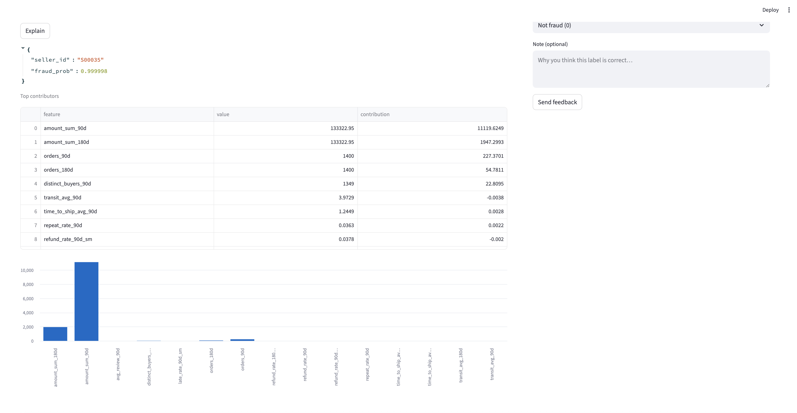

# Fraudulent Seller Detector (Demo)




Local, zero-cost demo of a marketplace **fraudulent-seller risk scorer** with:

* Offline feature pipeline
* LightGBM model + metrics
* FastAPI service (`/score`, `/explain`, `/feedback`)
* Streamlit reviewer dashboard with a **human-in-the-loop** feedback file
* Optional monitoring report (Evidently)

---


**Contracts between pieces**

* API expects:
  `artifacts/model.pkl`, `artifacts/feature_list.json`, and `data/processed/seller_features.parquet`.
* Dashboard assumes API is running at `http://localhost:8080` (change in `app/dashboard.py` if needed).

---

## Repo Layout (key parts)

```
app/
  dashboard.py                # Streamlit reviewer UI
configs/
  paths.yaml                  # Folder locations (edit to your machine if needed)
  features.yaml               # Feature settings
  model.yaml                  # Model hyperparams
  monitoring.yaml             # Monitoring config (optional)
src/
  data/                       # Build/validate demo raw data
    build.py
    fetch_raw.py
    make_sellers.py
    validate.py
    validate_markedplace.py
  features/
    build.py                  # Aggregates seller-level features
  models/
    train.py                  # Trains model, writes artifacts/metrics
    evaluate.py               # Prints/saves metrics
    make_top20.py             # Saves top-20 test predictions (for dashboard)
  monitoring/
    run.py                    # (Optional) generates drift/quality reports
  serve/
    api.py                    # FastAPI app
  utils/
    io.py                     # Small helpers
artifacts/                    # (created by code) model + metadata + metrics
data/                         # raw/, processed/, labels/
reports/                      # (optional) monitoring HTMLs
Makefile                      # Convenience targets
```

---

## Quickstart — Run It Yourself

### 0) Prereqs

* Python **3.10–3.13**
* macOS/Linux/WSL recommended
* (Optional) Node/Redis/Kafka **not required** for this demo

### 1) Clone & create a virtual env

```bash
git clone <your-fork-or-repo-url> fraud-seller-detector
cd fraud-seller-detector

# macOS/Linux
python3 -m venv .venv && source .venv/bin/activate
python -m pip install --upgrade pip wheel
```

### 2) Install dependencies


```bash
pip install -r requirements.txt
```


### 3) Verify/adjust paths

Open `configs/paths.yaml` and confirm these point where you want (default is inside the repo):

```yaml
raw_dir: data/raw
processed_dir: data/processed
artifacts_dir: artifacts
labels_dir: data/labels
```

### 4) Build demo data → features → train → evaluate

Using **Make** (preferred):

```bash
make data       # builds demo raw tables and validates them
make features   # aggregates seller-level features
make train      # trains LightGBM and writes artifacts/
make evaluate   # prints and writes metrics to artifacts/metrics.json
python -m src.models.make_top20   # optional: saves artifacts/top20_test.json
```

…or run the modules directly:

```bash
python -m src.data.build
python -m src.features.build
python -m src.models.train
python -m src.models.evaluate
python -m src.models.make_top20
```

You should now have:

* `artifacts/model.pkl`
* `artifacts/feature_list.json`
* `artifacts/metrics.json` (ROC-AUC, PR-AUC, etc.)
* `data/processed/seller_features.parquet`

### 5) Start the API

From the repo root:

```bash
uvicorn src.serve.api:app --reload --port 8080
```

Test it:

```bash
curl http://localhost:8080/health
curl -X POST http://localhost:8080/score -H "Content-Type: application/json" -d '{"seller_id":"S50033"}'
curl -X POST http://localhost:8080/explain -H "Content-Type: application/json" -d '{"seller_id":"S50033","top_k":10}'
```

### 6) Open the dashboard

In a new terminal (same venv):

```bash
streamlit run app/dashboard.py
```

* **Top-N** risky sellers table comes from `artifacts/top20_test.json`.
* **Explain** calls the API’s `/explain`.
* **Feedback** writes to `data/labels/feedback.jsonl` and updates `artifacts/feedback_overrides.json`.

### 7) Close the loop (retrain with feedback)

Any labels you submit via the dashboard/API are read on subsequent runs:

```bash
python -m src.features.build   # features are rebuilt and overrides applied
python -m src.models.train     # retrain; metrics updated
```

### 8) (Optional) Generate monitoring report

```bash
pip install evidently
python -m src.monitoring.run
# Open files in reports/ (e.g., drift.html) if they’re produced
```

> If you see `Evidently import failed`, you can skip monitoring; everything else works fine.

---

## API Reference (local)

* `GET /health` → basic info (`n_sellers`, `n_features`, model name)
* `POST /score` → `{"seller_id": "S50033"}` → `{seller_id, fraud_prob}`
* `POST /batch_score` → `{"seller_ids": ["S1","S2",...]}` → list of scores
* `POST /explain` → `{"seller_id":"S50033","top_k":10}` → baseline + top contributions
* `POST /feedback` → `{"seller_id":"S50033","label":1,"source":"ui","note":"..."}`

  * Appends to `data/labels/feedback.jsonl`
  * Updates `artifacts/feedback_overrides.json`

---

## Viewing Metrics

After `make evaluate` (or `python -m src.models.evaluate`) check:

* `artifacts/metrics.json` — ROC-AUC / PR-AUC (train & test)
* `artifacts/top20_test.json` — sample of highest-risk sellers from the test split

---

## Troubleshooting

* **`ModuleNotFoundError: No module named 'server'`**
  Run Uvicorn with the module path from the repo root:
  `uvicorn src.serve.api:app --reload --port 8080`

* **`404 seller_id not found`**
  Make sure you ran features + train, and choose a seller from `artifacts/top20_test.json`.

* **Evidently errors**
  It’s optional. If installation/import fails, skip monitoring and continue.

* **Port already in use**
  Change ports: `--port 8081` for API; Streamlit uses 8501 by default (`--server.port 8502` to change).

---

## Make Targets (convenience)

```bash
make data        # python -m src.data.build
make features    # python -m src.features.build
make train       # python -m src.models.train
make evaluate    # python -m src.models.evaluate
make serve       # uvicorn src.serve.api:app --reload --port 8080
make dashboard   # streamlit run app/dashboard.py
make monitor     # python -m src.monitoring.run
```

---

## License

MIT
---

